```mermaid
graph TD
    User(("Petición Usuario")) --> Veracity{"¿Verificación R0-R7?"}
    
    %% BLOCK 1: VERACIDAD & LÍMITES
    Veracity -- "No (Alucinación/Datos Faltantes)" --> Abort["R7: Abortar / Silencio"]
    Veracity -- "Sí (Verificado)" --> Secrets{"¿Check R13: Secretos/Permisos?"}
    Secrets -- "Fallo (Secrets/Perms)" --> Abort
    Secrets -- "OK" --> Analyze{"¿Tipo de Tarea?"}

    %% BLOCK 2: CÓDIGO (R9)
    Analyze -- "Modificación Código" --> Backup["R9.4: Backup .vN.bak"]
    Backup --> Edit["Aplicar Cambios (Diff R9.1)"]
    Edit --> Sim{"¿Simulación R9.2 OK?"}
    Sim -- "Fallo" --> Abort
    Sim -- "OK" --> UserRev{"¿Usuario Aprueba?"}
    
    UserRev -- "No (Rechazo)" --> Rollback["Undo: cp .bak original"]
    Rollback --> Retry{"¿Reintentar?"}
    Retry -- "Sí" --> Backup
    Retry -- "No" --> CleanFail["Fin Tarea"]
    
    UserRev -- "Sí (Aprobado)" --> Cleanup["rm .vN.bak"]
    Cleanup --> Commit["Confiar en Git (R9.4)"]
    Commit --> OutputLogic

    %% BLOCK 3: ALTO RIESGO (R10)
    Analyze -- "Infra / Datos Críticos" --> RiskEval{"¿R10: Alto Riesgo?"}
    RiskEval -- "Bajo Riesgo" --> ExecSimple["Ejecución Estándar"]
    RiskEval -- "Alto Riesgo" --> PreReqs{"¿Requisitos Previos?"}
    
    PreReqs -- "Falta (Snapshot System)" --> Block["R10.3: Bloqueo"]
    PreReqs -- "Completos" --> UserConf{"¿Confirmación User?<br>(Snapshot Ext)"}
    
    UserConf -- "No" --> Block
    UserConf -- "Sí" --> ExecHigh["R10: Ejecución Controlada"]
    ExecHigh --> Verify["Verificación Post-Cambio"]
    Verify --> OutputLogic
    ExecSimple --> OutputLogic

    %% BLOCK 4: CONSULTA SIMPLE
    Analyze -- "Consulta / Texto" --> OutputLogic

    %% BLOCK 5: SALIDA & ERROR (R8, R11, R12, R14)
    subgraph OutputLogic [Gestión de Salida]
        Format{"¿Selección Formato R8?"}
        Format -- "Simple" --> ModeL["Modo Ligero R8.1"]
        Format -- "Complejo/Técnico" --> ModeT["Modo Trazable R8.2"]
        
        ModeL --> Persona["Aplicar Tono R14 (Cosmético)"]
        ModeT --> Meta["Añadir Metadatos R11"]
        Meta --> Persona
        
        Persona --> FinalOut["/Respuesta Final/"]
    end

    FinalOut --> ErrorCheck{"¿Error Detectado R12?"}
    ErrorCheck -- "Sí" --> Patch["R12: Protocolo Corrección"]
    Patch --> Analyze
    ErrorCheck -- "No" --> End(("Fin"))

    %% ESTILOS
    style Abort fill:#ff3333,color:white,stroke:#333
    style Block fill:#ff3333,color:white,stroke:#333
    style Backup fill:#9933ff,color:white,stroke:#333
    style Rollback fill:#ff9900,color:black,stroke:#333
    style UserConf fill:#ffcc00,color:black,stroke:#333
    style ExecHigh fill:#00cc66,color:black,stroke:#333
    style OutputLogic fill:#2d2d2d,stroke:#666,stroke-dasharray: 5 5
```

# Protocolo Saturno v2.0 - Guía de Funcionamiento

Este documento explica de forma sencilla qué es el Protocolo Saturno, para qué sirve y cómo protege tu trabajo.

## ¿Qué es el Protocolo Saturno?

Imagina que este protocolo es el **manual de seguridad y sentido común** de la Inteligencia Artificial.

Cuando hablas con una IA normal, esta intenta complacerte rápidamente, lo que a veces causa errores: inventa datos ("alucinaciones"), borra archivos sin querer o rompe código por no revisar antes.

El **Protocolo Saturno** es un conjunto de reglas estrictas que obligan a la IA a "pensar antes de actuar". Convierte a la IA en un **Auditor Técnico**: alguien que prefiere decir "no sé" a inventar una respuesta, y que prefiere pedir permiso antes que romper algo.

---

## ¿Cómo funciona? (El Flujo de Operación)

Cada vez que pides algo, la IA no ejecuta la orden inmediatamente. En su lugar, pasa tu petición por una serie de "filtros de seguridad", uno por uno, como si fuera una lista de chequeo de vuelo.

Aquí te explicamos el proceso paso a paso (que puedes ver resumido en la imagen de abajo):

### Paso 1: El Filtro de la Verdad (¿Es real?)
Lo primero que hace la IA es preguntarse: **"¿Tengo pruebas de lo que voy a decir?"**.
*   Si le pides un dato y no lo tiene en sus archivos -> **Se detiene.** Te dirá "No puedo confirmar esto" en lugar de inventar.
*   Si intenta adivinar -> **El protocolo lo prohíbe.**

### Paso 2: La Red de Seguridad (Si toca código)
Si tu petición implica cambiar código (ej: "Refactoriza este archivo"), la IA activa su **sistema de copias de seguridad**.
*   **Antes de tocar nada**, crea una copia exacta de tu archivo con un número de versión (ej: `archivo.js.v1.bak`).
*   Esto significa que si el cambio no te gusta, la IA puede "viajar en el tiempo" y dejarlo todo como estaba en un segundo.

### Paso 3: El Control de Peligro (Si toca infraestructura)
Si tu petición es arriesgada (ej: "Borra la base de datos" o "Sube esto a producción"), la IA se bloquea automáticamente.
*   **No actuará** hasta que tú le confirmes explícitamente que tienes una copia de seguridad externa (Snapshot) de todo el sistema.
*   Es como un botón rojo nuclear: se necesitan dos llaves (la tuya y la de la IA) para girarlo.

### Paso 4: Ejecución Segura
Solo si la petición pasa todos estos filtros (es verdad, hay backup local y tienes permiso), la IA ejecuta la acción.

---

## Visualización del Proceso

El siguiente diagrama representa este "cerebro" lógico. Sigue las flechas para ver cómo la IA decide qué hacer con tu petición:

---

## Estructura Técnica (Para Curiosos)

Para que esto funcione, el protocolo está escrito en dos "idiomas":
1.  **`Protocol.md` (Para Humanos):** El documento que lees con explicaciones y sentido.
2.  **`Protocol.json` (Para la Máquina):** Una versión comprimida y estricta que la IA lee para saber qué reglas aplicar matemáticamente.
